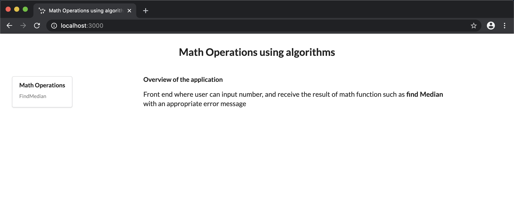
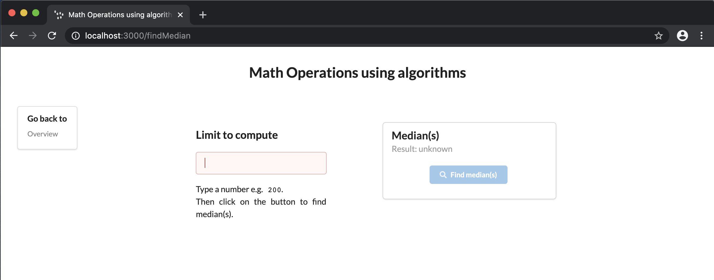

# SIEVE OF ERATOSTHENES TEST

A full stack web application which finds the median of prime number given n limit.

## Getting Started
Install `yarn` if not already installed: `npm install yarn -g`

<div>
  <details>
    <summary><strong>With VS Code</strong></summary>
    <br />
    Prerequisites: Chrome and VS Code with 'Debugger for Chrome' extension.<br/><br/>
    <ul>
      <li>Clone the <code>sieve_of_eratosthenes_test</code> repository:<br/>
        <br/>
        <code>git clone https://github.com/dhruvinparikh93/sieve_of_eratosthenes_test.git</code><br/>
        <code>cd sieve_of_eratosthenes_test</code><br/>
        <br/>
      </li>
      <li>Install dependencies:
        <p>
          <code>yarn install</code>
        </p>
      </li>
      <li>Open the workspace file in VS Code:
        <p>
          <code>code ./sieve_of_eratosthenes_test.code-workspace</code>
        </p>
      </li>
      <li>Start the debugging configuration <code>'Debug Client and Backend (workspace)'</code>.</li>
      <br/>
      <li>Wait until an instance of Chrome starts. You should see the Overview page:
        <p>
          
        </p>
        <br/>
      </li>
      <li>Choose the <code>FindMedian</code> component from the menu. You should see its page:
        <p>
          
        </p>
        <br/>
      </li>
      <li>Stop the running debugging configuration (use the 'Stop' button on VS Code Debugging toolbar two times or press <code>Control+F5</code> twice).</li>
    </ul>
  </details>
</div>
<div>
  <details>
    <summary><strong>Without VS Code</strong></summary>
    <br />
    After executing the following commands:<br/>
	<br/>
    <code>  git clone https://github.com/dhruvinparikh93/sieve_of_eratosthenes_test.git</code><br/>
    <code>  cd sieve_of_eratosthenes_test</code><br/>
    <code>  yarn install && yarn start:prod</code><br/>
    <br/>
    you will have a running instance of backend (e.g. Express) serving the newly built React app that can be seen by pointing a browser to <code>localhost:3000</code>.<br/>
    Terminate the backend by pressing <code>Control+C</code>.
  </details>
</div>

## Features
### Client and Backend Subprojects
Each subproject supports execution of the following commands/scripts:
```
yarn compile
yarn lint
yarn test
yarn dev
```

The client subproject:
 * Starts webpack-dev-server listening on port 8080 in the development mode.
 * Creates build artifacts (html files, script bundles and source maps) in the production mode. The artifacts are meant to be copied over to the backend subproject to be served by Express.
 * Additionally can start an instance of Chrome controlled via Inspector protocol (with caching disabled for better debugging) and point it to either webpack-dev-server or the backend server.
> webpack-dev-server can be referred to as 'devserver'.

The backend subproject:
 * In the production mode starts Express listening on port 3000 to serve from disk the build artifacts created by the client subproject .
 * In the development mode starts Express listening on the same port and working as a proxy for webpack-dev-server.
 * Implements HTTP caching arrangement which disables the caching for .html files and enables it for script bundles. A typical React application comes with .html files that are rather small whereas the bundles can be significantly larger. On the other hand, the build process keeps the names of .html files static and embeds a hash into the names of script bundles. As a result the caching arrangement ensures smooth deployment of versioning changes.

## Goals + Tasks

- [x] Server (typescript nodejs)
    - [x] Express API
    - [x] Jests test cases
- [x] Client (React)
    - [x] UI framework (semantic-ui)
    - [x] Jests test cases
- [ ] CI/CD build pipeline (not part of task)
- [ ] Containerization (not part of task) 
- [ ] Google cloud Run (not part of task)
 
#### Resources

* [typescriptlang](https://www.typescriptlang.org/)
* [jestjs](https://jestjs.io)
* [crisp-react](https://github.com/winwiz1/crisp-react.git)
